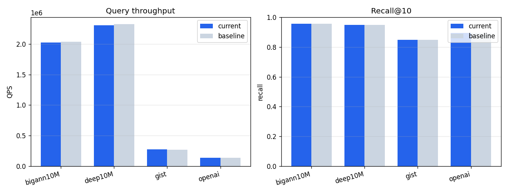
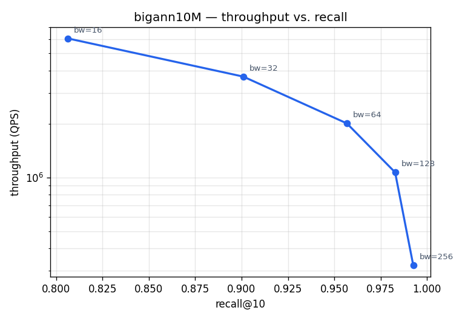

# Jasper: Fast and scalable GPU-native ANNS index

Jasper is a GPU-native approximate nearest neighbor search (ANNS) index designed for speed and scalability. Drawing on the Vamana graph index and RaBitQ quantization, Jasper delivers state-of-the-art construction throughput and query performance entirely on the GPU.

The core algorithms are based on our research paper: [GPU-Accelerated ANNS: Quantized for Speed, Built for Change](https://arxiv.org/abs/2601.07048). This repository extends the [original experiment code](https://github.com/saltsystemslab/JasperGPUANNS) into a reusable header-only CUDA library with Python bindings via [TVM FFI](https://github.com/apache/tvm-ffi).


## Why Jasper?

- **Fast construction and search.** Jasper matches or exceeds state-of-the-art GPU-based ANNS libraries in both index build throughput and query latency.
- **Index updates.** Jasper supports inserting vectors without rebuilding the entire index.
- **RaBitQ quantization.** Jasper uses RaBitQ for vector quantization, which achieves higher performance than traditional product quantization and maps naturally to GPU computations.

## Compilation

Compile library
```bash
# Install tvm_ffi
pip install apache-tvm-ffi

# Build the FFI shared library
cmake -B build -DJASPER_BUILD_FFI=ON -DJASPER_BUILD_CMD=ON
cmake --build build -j
cmake --install build
pip install -e python/
```

Run tests
```bash
cmake -B build -DJASPER_BUILD_TESTS=ON
cmake --build build
cd build && ctest --output-on-failure
```

## Python Usage

All Python APIs can be found under the `example/` folder, where we provides python scripts to construct and query vector index in jasper. See `example/graph.py` for building and searching in one pass, `example/query.py` for loading a saved index and running queries, and `example/groundtruth.py` for generating exact k-NN ground truth to measure recall.

### Import

```python
import jasper
```

### Build a graph and search

```python
import torch
import jasper

vectors = torch.randn(1_000_000, 128, dtype=torch.float16, device="cuda")
# vectors: torch.Tensor, shape [n_vectors, dim], dtype=torch.float16, CUDA

g = jasper.Graph.build(
    vectors,             # torch.Tensor  [n_vectors, dim], dtype=torch.float16
    n_neighbors=64,       # int    — max neighbors per node (R)
    distance="l2",        # str | DistanceFunc — "l2" or "ip"
    alpha=1.2,             # float  — pruning factor (1.0=strict, >1.0=longer hops)
)
# g: jasper.Graph

queries = torch.randn(100, 128, dtype=torch.float16, device="cuda")
# queries: torch.Tensor, shape [n_queries, dim], dtype=torch.float16, CUDA

indices, distances = g.search(
    queries,              # torch.Tensor  [n_queries, dim], dtype=torch.float16, CUDA
    k=10,                  # int    — number of neighbors to return
    beam_width=64,          # int    — search beam width
)
# indices:   torch.Tensor, int32,   shape [n_queries, k]
# distances: torch.Tensor, float32, shape [n_queries, k]
```

### Load a graph from file and search

```python
g = jasper.Graph.load(
    "sift1m.graph",       # str  — path to graph binary file
    dim=128,               # int  — vector dimensionality
    n_neighbors=32,         # int  — max neighbors per node (R), must match file
)
# g: jasper.Graph

indices, distances = g.search(
    queries,   # torch.Tensor, [n_queries, dim], dtype=torch.float16, CUDA
    k=10,        # int — number of neighbors to return
)
# indices:   torch.Tensor, int32,   shape [n_queries, k]
# distances: torch.Tensor, float32, shape [n_queries, k]
```

### Save a graph

```python
g.save(
    "sift1m.graph",  # str — destination file path
)
# returns: None
```

### Insert vectors

Append new vectors to a live graph without rebuilding. Their edges are wired
into the existing graph (beam-search + robust-prune, same as construction) and
each vector is assigned a fresh, monotonically increasing **stable id**.

```python
new_vectors = torch.randn(10_000, 128, dtype=torch.float16, device="cuda")
# new_vectors: torch.Tensor, [n, dim], dtype=torch.float16, CUDA

ids = g.append(
    new_vectors,   # torch.Tensor, [n, dim], dtype=torch.float16, CUDA
    alpha=1.2,      # float — robust-pruning factor for the new vectors' edges
)
# ids: torch.Tensor, int32, shape [n] — assigned stable ids, in input order
```

Stable ids are the ids returned by `search`; they are never reused and are
unchanged by `consolidate`/`compact`. To reserve ids up front (e.g. to write
vectors yourself), use `g.reserve_ids(count)`, which returns an int32 CPU
tensor of `count` fresh ids and advances the id counter.

### Delete vectors

Deletion is a two-phase process: a cheap **soft-delete** that immediately hides
vectors from search, followed by an occasional **consolidate**/**compact** to
repair the graph and reclaim space.

```python
g.mark_deleted(
    ids,   # torch.Tensor, 1-D integer — vector (stable) ids to delete
)
# returns: None
# Deleted vectors are excluded from search immediately. Out-of-range ids are ignored.

g.consolidate(
    alpha=1.2,   # float — robust-pruning factor when re-selecting edges
)
# returns: None
# Repairs edges routing through deleted vertices and clears all tombstones
# (afterwards g.n_tombstoned == 0). Stable ids are unchanged.

g.compact()
# returns: None
# Reclaims space by packing live vectors into slots [0, n_live).
# Consolidates first if there are pending deletions. Stable ids are preserved.
```

Inspect deletion state:

```python
print(g.n_live)         # int — vectors still live (n_vectors - n_tombstoned)
print(g.n_tombstoned)   # int — soft-deleted vectors not yet consolidated away
```

### Read vectors from a binary file

```python
vectors = jasper.read_bin(
    "sift1m_base.fvecs.bin",  # str — path to binary vector file
    dtype="f32",                # str — on-disk dtype, "f32" or "u8"
).to("cuda")
# vectors: torch.Tensor, dtype=torch.float16, shape [n_vectors, dim], CUDA
```

### Evaluate recall against ground truth

```python
gt_ids, gt_dists = jasper.read_groundtruth(
    "sift1m_groundtruth.bin",  # str — path to ground truth binary file
    k=10,                        # int — number of neighbors to load
)
# gt_ids:   torch.Tensor, int32,   shape [n_queries, k]
# gt_dists: torch.Tensor, float32, shape [n_queries, k]

recall = jasper.get_recall(
    gt_ids,               # torch.Tensor / indexable — ground truth ids, shape [n_queries, k]
    indices.cpu(),          # torch.Tensor / indexable — search result ids, shape [n_queries, k]
    k=10,                     # int — number of neighbors considered per query
    n_queries=indices.shape[0],  # int — number of queries
)
# recall: float — value in [0, 1]
```

### Generate your own ground truth

```python
gt_ids, gt_dists = jasper.generate_groundtruth(
    vectors,        # torch.Tensor, CPU, [n, dim], dtype=float32 or float16
    queries,          # torch.Tensor, CPU, [nq, dim], dtype=float32 or float16
    k=100,              # int — number of neighbors to compute
    distance="l2",        # str — "l2" or "ip"
)
# gt_ids:   torch.Tensor, int32,   shape [nq, k], CPU
# gt_dists: torch.Tensor, float32, shape [nq, k], CPU

jasper.save_groundtruth(
    "groundtruth.bin",  # str — destination file path
    gt_ids,               # torch.Tensor, int32/int, shape [nq, k]
    gt_dists,               # torch.Tensor, float32,   shape [nq, k]
)
# returns: None
```

### Inspect a graph

```python
print(g)              # g: jasper.Graph -> str, e.g. Graph(n_vectors=1000000, dim=128, R=64, dtype=f16, dist=l2)
print(g.n_vectors, g.dim, g.n_neighbors)
# g.n_vectors:   int
# g.dim:         int
# g.n_neighbors: int

vec = g.get_vector(
    42,  # int — zero-based vector index
)
# vec: torch.Tensor, dtype=torch.float16, shape [dim], CUDA
```

### Free a graph

```python
g.free()
# returns: None
```
## Benchmarks

Updated automatically by neu-ci after each nightly cluster run.

### QPS vs. recall

<!--neu-ci:qps_recall start-->


_updated 2026-08-04 03:25 UTC_
<!--neu-ci:qps_recall end-->

### Latest results

<!--neu-ci:results start-->
| dataset | insert_vps | query_qps | recall | delete_ms | live_recall | viol | consolidate_ms | append_vps |
| --- | --- | --- | --- | --- | --- | --- | --- | --- |
| bigann10M | 454024.0 | 2024974.0 | 0.9568 | 1.8 | 0.9569 | 0 | 3094.1 | 252425.0 |
| deep10M | 638085.0 | 2305065.0 | 0.9487 | 1.7 | 0.9492 | 0 | 2586.2 | 295110.0 |
| gist | 171321.0 | 275170.0 | 0.8473 | 0.8 | 0.8469 | 0 | 976.5 | 162293.0 |
| openai | 50634.0 | 139359.0 | 0.8936 | 1.1 | 0.8936 | 0 | 14958.1 | 35279.0 |

_updated 2026-08-04 03:25 UTC_
<!--neu-ci:results end-->

### Throughput vs. recall tradeoff (bigann10M)

<!--neu-ci:tradeoff start-->


_updated 2026-08-04 03:25 UTC_
<!--neu-ci:tradeoff end-->

## Citation

```
@misc{mccoy2026gpuacceleratedannsquantizedspeed,
      title={GPU-Accelerated ANNS: Quantized for Speed, Built for Change}, 
      author={Hunter McCoy and Zikun Wang and Prashant Pandey},
      year={2026},
      eprint={2601.07048},
      archivePrefix={arXiv},
      primaryClass={cs.DB},
      url={https://arxiv.org/abs/2601.07048}, 
}
```
