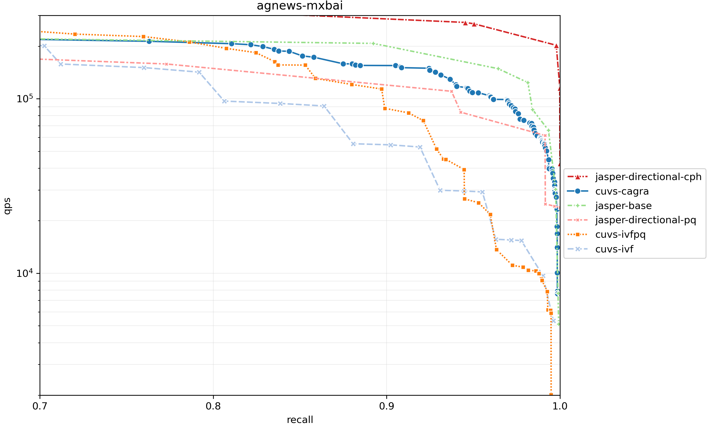

# Jasper

**Fast and scalable GPU-native ANNS index.**

Jasper is a GPU-native approximate nearest neighbor search (ANNS) index designed for speed and scalability. Drawing on the Vamana graph index, Jasper delivers state-of-the-art construction throughput and query performance entirely on the GPU.

[:material-arrow-right: Quick Start](quickstart.md){ .md-button .md-button--primary }
[:material-code-tags: Python API](api.md){ .md-button }

## Why Jasper?

- **Fast construction.** Jasper matches or exceeds state-of-the-art GPU-based ANNS libraries in index build throughput, and scales out to billion-vector datasets.
- **Directional beam search.** Jasper supports directional beam search, a faster search algorithm and index layout for both device-memory and host-memory search.
- **Index insert, update, and delete.** Jasper supports index updates without rebuilding the entire index.
- **RaBitQ quantization.** Jasper supports RaBitQ for vector quantization, which achieves higher performance than traditional product quantization and maps naturally to GPU computations.

## Query Performance



_Query throughput vs. recall on agnews-mxbai dataset (1024 dimensions) using NVIDIA RTX 6000 blackwell server edition GPU. [^1]_

[^1]: Benchmarked with [VIBE](https://github.com/vector-index-bench/vibe), a benchmark suite for vector search.

## Papers

- [GPU-Accelerated ANNS: Quantized for Speed, Built for Change](https://arxiv.org/abs/2601.07048), VLDB 2026.
- [Directional Beam Search](https://prashantpandey.github.io/assets/pdf/uploads/vecdb26_dbs.pdf), VecDB Workshop 2026.

## Citation

```bibtex
@misc{mccoy2026gpuacceleratedannsquantizedspeed,
      title={GPU-Accelerated ANNS: Quantized for Speed, Built for Change},
      author={Hunter McCoy and Zikun Wang and Prashant Pandey},
      year={2026},
      eprint={2601.07048},
      archivePrefix={arXiv},
      primaryClass={cs.DB},
      url={https://arxiv.org/abs/2601.07048},
}
```
